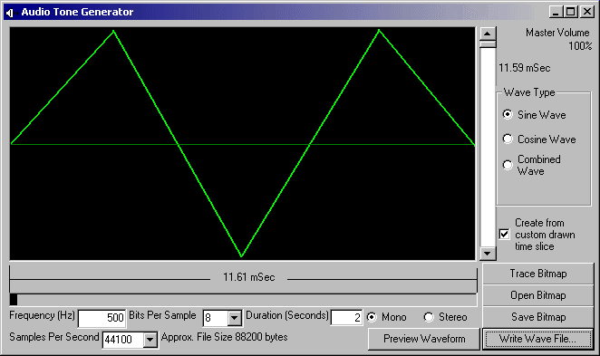

<div align="center">

## Tone Generator


</div>

### Description

This proj allows you to make audio tones and save them as a wave file. If you have looked at any Oscope type graphs of audio and wondered if you could create sound just by drawing, well, you can. It allows you to create Sine, Cosine, and a Combined signal at different frequencies. You can also draw your own wave clip in either the window or your favorite graphic editor. Use a 512w X 256h bitmap. Any color for the signal, as long as the background is black. To use this feature, Click the 'open bitmap' button and find your saved bitmap (you can also simply draw your own in the program) Then click 'Trace Bitmap' Now be sure to select the 'Use custom drawn' checkbox. Choose your wave properties, then click 'write wave' If you recieve an error when saving a custom sound, try removing any signal points that are very near the top or bottom of the bitmap. I have included a few of my own bitmaps for you to play with (Don't worry, the zip is only 14KB). I would like to thank Alex Murray and his "Bass Maker" for inspiration. Vote if you would like, or don't, but please leave feedback.
 
### More Info
 
Frequency, Bitrate, Samplerate, Length, Channels

A wave file


<span>             |<span>
---                |---
**Submitted On**   |2004-06-01 00:34:22
**By**             |[Erik Stites](https://github.com/Planet-Source-Code/PSCIndex/blob/master/ByAuthor/erik-stites.md)
**Level**          |Intermediate
**User Rating**    |3.9 (27 globes from 7 users)
**Compatibility**  |VB 5\.0, VB 6\.0
**Category**       |[Sound/MP3](https://github.com/Planet-Source-Code/PSCIndex/blob/master/ByCategory/sound-mp3__1-45.md)
**World**          |[Visual Basic](https://github.com/Planet-Source-Code/PSCIndex/blob/master/ByWorld/visual-basic.md)
**Archive File**   |[Tone\_Gener175223612004\.zip](https://github.com/Planet-Source-Code/erik-stites-tone-generator__1-54115/archive/master.zip)

### API Declarations

```
Public Declare Function GetPixel Lib "gdi32" (ByVal hdc As Long, ByVal x As Long, ByVal y As Long) As Long
```


